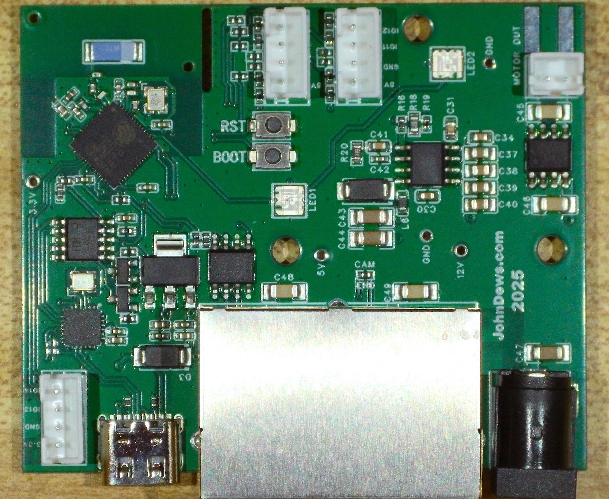
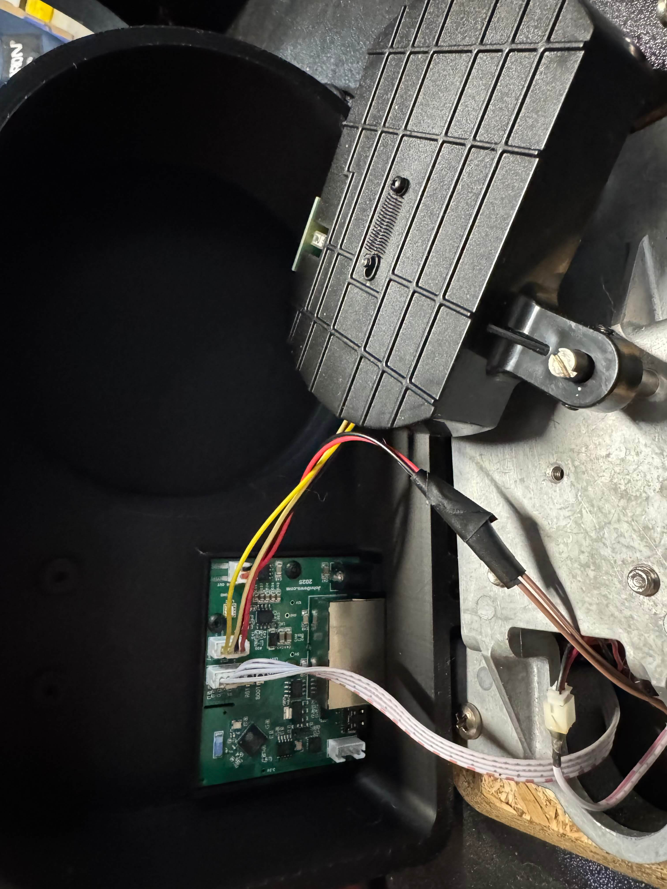
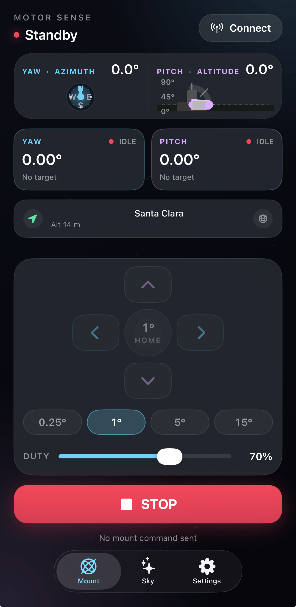

# MotorSense

[](https://github.com/ChooseDews/MotorSense/actions/workflows/build-firmware.yml)

A closed-loop motor-control retrofit for the **Orion SkyQuest XTg** GoTo
Dobsonian: one ESP32-S3 board per axis (yaw + pitch) that drives the mount
motor and reads a quadrature encoder for closed-loop positioning. The boards
speak a simple newline-terminated command console over BLE and USB serial
(`AXIS MOVE 12.5`, `MOTOR F 70`), so the apps below — or anything that can open
a BLE serial link — can drive the telescope.

| The board | In the telescope |
| --- | --- |
|  |  |
| *V1 controller board — see [board/](board) for schematic, GPIO map and ICs.* | *Board installed in the mount base, wired to the axis motor and encoder.* |

## Apps

| App | Folder | Run / build |
| --- | --- | --- |
| **iOS** | [clients/ios](clients/ios) | Open `MotorSense.xcodeproj` in Xcode and run on a phone ([README](clients/ios/README.md) — incl. BLE firmware updates) |
| **Web client** | [clients/web](clients/web) | `cd clients/web && npm install && npm run dev` (Chrome/Edge for Web Bluetooth) |
| **Python tools** | [clients/python](clients/python) | `cd clients/python && uv run motor-sense-telescope` (also `ble-serial`, LX200/INDI/Stellarium bridges) |



*iOS app: connect both controllers, read out yaw/pitch, drive each axis in
selectable steps, align the encoders to the phone's compass/IMU, and update
firmware over BLE.*

## Firmware

ESP-IDF v5.5 targeting the ESP32-S3. One image serves every board — the axis
role (`YAW`/`PITCH`) and calibration are runtime settings in NVS. Full build and
flashing guide in [firmware/README.md](firmware/README.md); in short:

```sh
. ~/esp/esp-idf/export.sh
idf.py -B build -D SDKCONFIG=sdkconfig.unified build
idf.py -B build -p <port> flash monitor
```

> **Always pass `-D SDKCONFIG=sdkconfig.unified`.** The `firmware/sdkconfig` at
> the repo root is a stale leftover (single-app partition table, OTA rollback
> disabled), so a plain `idf.py build` would silently produce an image without
> working OTA.

**Full flash** (blank board or recovery) — program everything at once with the
merged image from the CI artifact, or from your own build:

```sh
idf.py -B build merge-bin     # produces build/merged-binary.bin
esptool.py --chip esp32s3 -p <port> write_flash 0x0 build/merged-binary.bin
```

or image by image:

```sh
esptool.py --chip esp32s3 -p <port> --baud 921600 write_flash \
  0x0      build/bootloader/bootloader.bin \
  0x8000   build/partition_table/partition-table.bin \
  0x10000  build/motorsense.bin \
  0x1f0000 build/ota_data_initial.bin
```

## Repository map

| Path | What it is |
| --- | --- |
| `firmware/` | ESP-IDF firmware: BLE console, closed-loop axis motion, encoder decoding, ADC, OTA |
| `clients/ios/` | iOS control app (Swift/Xcode) |
| `clients/web/` | Vue 3 + Vite web client (Web Bluetooth) |
| `clients/python/` | Python CLI/GUI and telescope app, LX200/INDI bridges (uv) |
| `board/` | V1 controller board: EasyEDA project, photos, GPIO map |
| `docs/` | Per-component docs and images |
| `tools/`, `tests/` | Host utilities (BLE OTA, camera validation) and firmware tests |

## Docs

- [Firmware](firmware/README.md) — build, flash methods, OTA, console commands
- [Board](board/README.md) — schematic, photos, GPIO map, key ICs
- [Architecture](docs/architecture.md) — how the pieces fit together
- [Web client](docs/client.md), [Python tools](docs/tools.md), [Camera tracker](docs/tracker.md), [iOS app](clients/ios/README.md)
