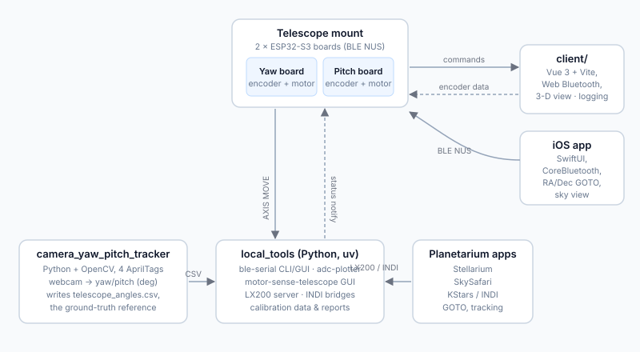

# MotorSense

A closed-loop alt-az telescope mount built from two ESP32-S3 boards — one per axis — with quadrature-encoder feedback, plus the web client, Python host tools, iOS app, and a camera-based angle tracker that surrounds it.

Everything talks to the boards over BLE using simple newline-terminated commands (`AXIS MOVE ...`), so any language or app can drive the mount.


*The AprilTag tracker measuring yaw/pitch of the mounted telescope (ids 0, 2, 3 on the mount base, scope tag on top).*

## What's in this repo

| Folder | What it is |
| --- | --- |
| `main/` | ESP-IDF firmware: BLE serial, closed-loop axis motion, encoder decoding, ADC, persistent board roles, BLE OTA |
| `client/` | Vue 3 + Vite web app (Web Bluetooth): control, encoder readout, logging, 3-D view |
| `local_tools/` | Python tools (uv): BLE serial CLI/GUI, telescope control app, LX200/INDI bridges, calibration data |
| `camera_yaw_pitch_tracker/` | OpenCV AprilTag tracker that measures true yaw/pitch for calibration |
| `docs/` | Architecture, per-component docs and images |

## Architecture



See [docs/architecture.md](docs/architecture.md) for details.

## Quick start

**Firmware** (ESP-IDF 5.x, target ESP32-S3):

```sh
idf.py set-target esp32s3
idf.py menuconfig   # optional
idf.py build flash monitor
```

**Web client** (Chrome/Edge required for Web Bluetooth):

```sh
cd client && npm install && npm run dev
```

**Host tools** (any BLE-capable machine):

```sh
cd local_tools && uv run motor-sense-telescope   # full control GUI
uv run ble-serial                                # interactive BLE console
```

**Camera tracker** (macOS, webcam + printed AprilTags):

```sh
cd camera_yaw_pitch_tracker && .venv/bin/python telescope_tracker_dual_base_with_log.py
```

**iOS app**: open `local_tools/ios_app/MotorSense/MotorSense.xcodeproj` in Xcode and run.

## Docs

- [Architecture](docs/architecture.md) — how the pieces fit together
- [Firmware](docs/firmware.md) — modules, build, serial command set
- [Web client](docs/client.md)
- [Camera tracker](docs/tracker.md) — AprilTag rig and calibration workflow
- [Host tools](docs/tools.md) — telescope app, LX200/INDI, calibration results
