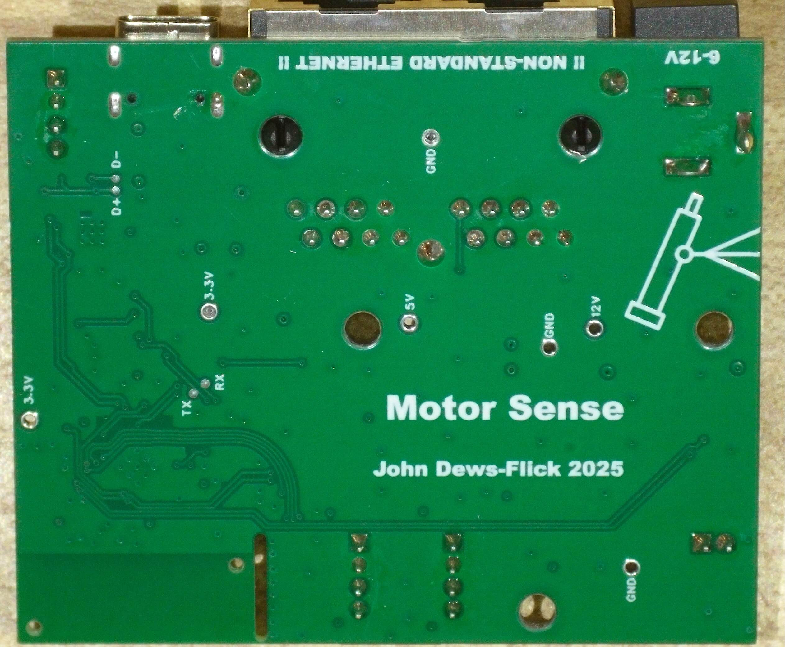

# MotorSense controller board (V1)

One board = one axis of the [MotorSense alt-az telescope mount](../README.md): an
ESP32-S3 based closed-loop motor controller that drives its axis motor, reads a
quadrature encoder, and speaks the MotorSense command console over BLE and USB
serial. The YAW and PITCH boards are identical — the role is set at runtime with
`DEVICE ROLE YAW|PITCH` (see the [firmware docs](../firmware/README.md)).

*Top side of the assembled V1 board: ESP32-S3 with PCB antenna (top left), USB-C,
encoder/sensor ports, MOTOR OUT and the RJ45 link.*

*Bottom side: "Motor Sense — John Dews-Flick 2025", the 6-12 V input marking, test
points and the telescope outline. The RJ45 is helpfully labelled
"!! NON-STANDARD ETHERNET !!" — it is not Ethernet.*

*Installed: the board inside the mount base, wired to the axis motor and
encoder through its JST-PH ports.*

## What's on it

- **ESP32-S3** bare chip (R8 variant, 8 MB octal PSRAM) with an on-board PCB
  antenna, a 40 MHz crystal and 2 MB SPI flash.
- **USB-C via a CH334F USB 2.0 hub** — one cable exposes both the CH340K
  USB-UART console (with DTR/RTS auto-reset into download mode) *and* the
  ESP32-S3's native USB.
- **BL5617 H-bridge motor driver**, powered straight from the 6-12 V input,
  driving the 2-pin **MOTOR OUT** connector (PWM on GPIO6/7).
- **SN65HVD230 CAN transceiver wired to an RJ45 jack** — the "non-standard
  Ethernet" port carries CANH/CANL plus 12 V and GND over a Cat5 cable, so the
  two axis boards (and motor power) can be daisy-chained on the mount.
- **Power**: 6-12 V barrel jack → TPS54331 buck converter → 5 V rail
  (diode-ORed with USB 5 V) → AMS1117-3.3 for the 3.3 V rail.
- **I/O**: two JST-PH 4-pin encoder/sensor ports (5 V, GND + two GPIOs each,
  through series resistors) and one JST-PH 4-pin port on 3V3/GND/GPIO13/GPIO14.
- **2× WS2812B** addressable RGB LEDs (daisy-chained on GPIO39), **EN/RST** and
  **BOOT** buttons, and test points for 12 V, 5 V, 3.3 V, GND, TX/RX, D+/D−,
  CAM and ENC.
- 53 × 64 mm, 2-layer PCB.

## GPIO map

| Function | GPIO(s) | Board location |
| --- | --- | --- |
| Motor H-bridge PWM (BL5617) | 6, 7 | `MOTOR OUT` (JST-PH 2-pin) |
| Encoder 0 — axis encoder (Schmitt decode) | 11, 12 | 4-pin port, silkscreened `IO11`/`IO12` |
| Encoder 1 (DMA) / ADC inputs | 9, 10 | other 4-pin port |
| Spare sensor port | 13, 14 | 4-pin port (3V3, GND, GPIO13, GPIO14) |
| CAN TX / RX (SN65HVD230) | 17, 18 | RJ45 (with 12 V + GND) |
| WS2812B LED chain | 39 | LED1 → LED2 |
| Native USB | 19, 20 | USB-C via the CH334F hub |
| BOOT button | 0 | also EN/RST button on reset |

The firmware treats encoder 0 on GPIO11/12 as the mechanical axis encoder
(`ENCODER` commands), streams the ADC inputs, and drives the motor with
`MOTOR`/`AXIS` commands — all documented in the [firmware README](../firmware/README.md).

## Files

| File | What it is |
| --- | --- |
| `Motor_Sense_2025-12-15_V1.epro` | EasyEDA Pro project: schematic (sheets `core`, `Power Supply`, `Motor Power Level`) + PCB layout |

To edit the design, open the `.epro` in
[EasyEDA Pro](https://pro.easyeda.com/) (v2.2+ was used for this project) and
export Gerbers/drill files from there for fabrication.

## Key ICs

| Part | Role |
| --- | --- |
| ESP32-S3 (R8) | MCU: BLE, dual-axis firmware, OTA ([datasheet](https://www.espressif.com/en/products/socs/esp32-s3)) |
| CH334F | USB 2.0 hub ([datasheet](https://www.wch-ic.com/downloads/CH334DS1_PDF.html)) |
| CH340K | USB-UART console |
| BL5617 | H-bridge motor driver (6-12 V) |
| SN65HVD230 | 3.3 V CAN transceiver |
| TPS54331 | 12 V → 5 V buck converter |
| AMS1117-3.3 | 3.3 V LDO |
