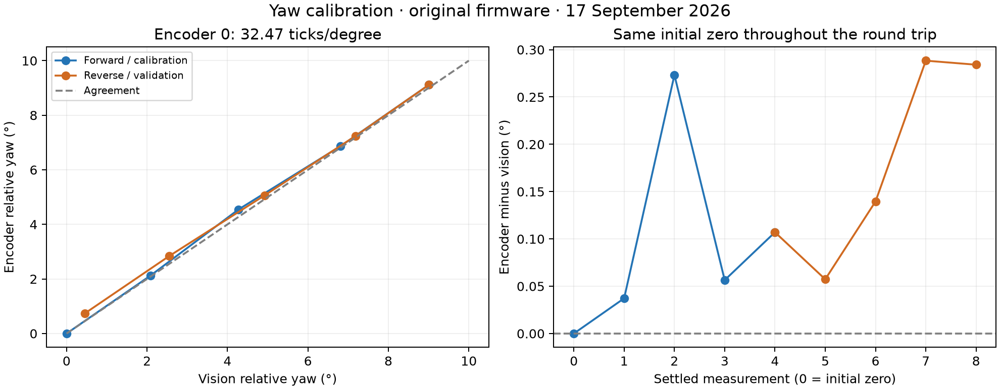
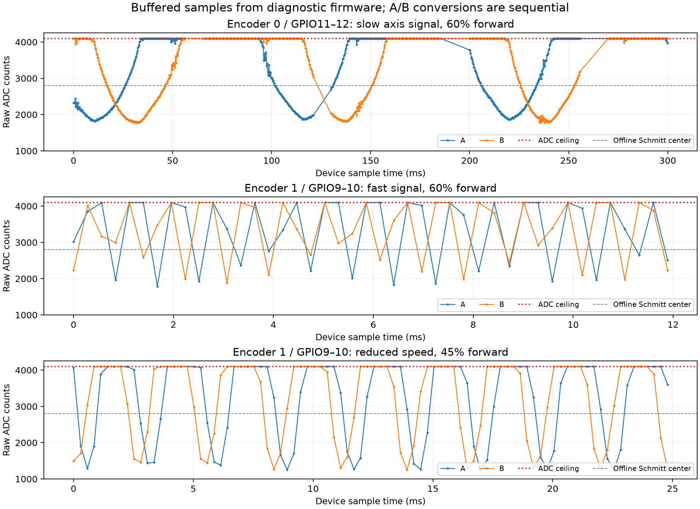
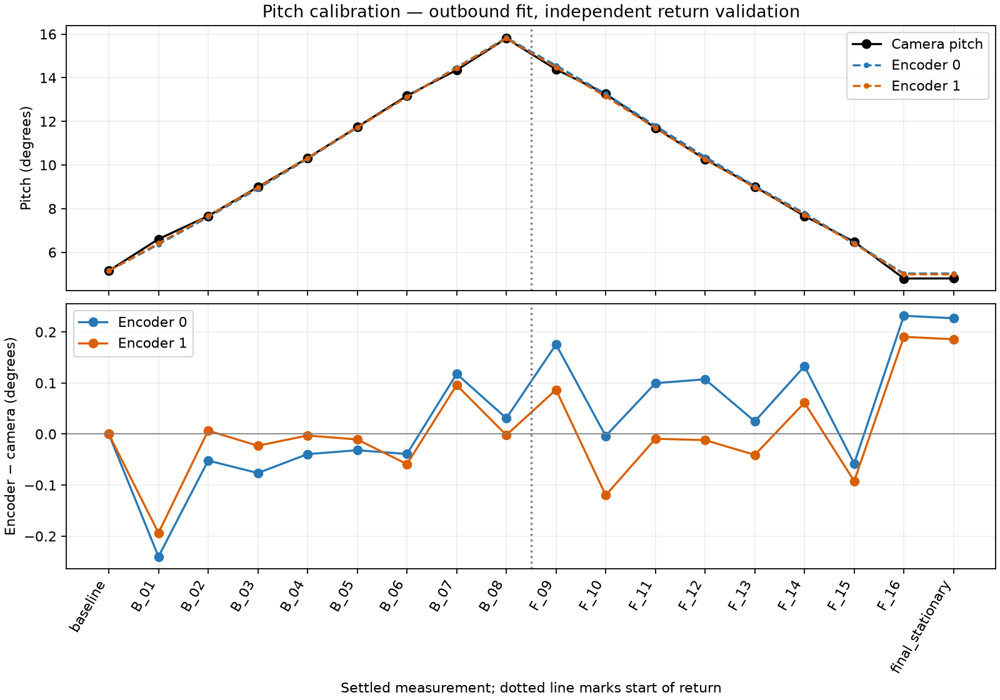

# Host tools (`local_tools/`)

Python package managed with [uv](https://docs.astral.sh/uv/). All entry points run from this folder:

| Command | What it is |
| --- | --- |
| `uv run motor-sense-telescope` | Main control GUI: connect both axes, closed-loop GOTO, sweeps |
| `uv run ble-serial` / `ble-serial-gui` | Interactive BLE console (auto-connects to `MotorSense` devices) |
| `uv run lx200-telescope` | LX200 protocol server (pty/TCP) for Stellarium, SkySafari, … |
| `uv run indi-custom-mount` | Thin Unix-socket adapter for a custom INDI mount driver |
| `uv run motor-sense-lx200-bridge` | LX200-over-TCP bridge from INDI's LX200 driver |
| `uv run adc-plotter` | Plot raw ADC/encoder streams |

## Telescope app

`motor-sense-telescope` scans and connects both boards at once (`MotorSense Caboose-78` = yaw, `Caboose-158` = pitch) and sends `AXIS MOVE` commands, keeping the closed loop on the boards. It also exposes a local Unix socket (`~/Library/Application Support/MotorSense/telescope.sock`) that the INDI/LX200 bridges speak.

The **External calibration** section compares settled encoder moves against the camera tracker's `telescope_angles.csv` (see [tracker.md](tracker.md)): it commands yaw/pitch sweeps, waits for each move to settle, and reports per-point plus RMS/max error.

## Calibration results

Charts and captures from the encoder/calibration campaigns live in `local_tools/calibration/` (reports: `REPORT.md`, `ENCODER_DMA_REPORT.md`, `PITCH_ENCODER_REPORT.md`).

## iOS app

`ios_app/MotorSense` is a SwiftUI app (CoreBluetooth) with per-axis calibration, RA/Dec GOTO using CoreLocation + telescope math, and a sky view. Open `MotorSense.xcodeproj` in Xcode and run on a device.
