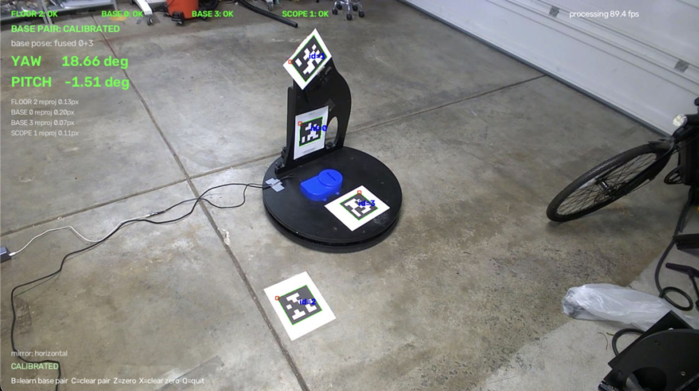
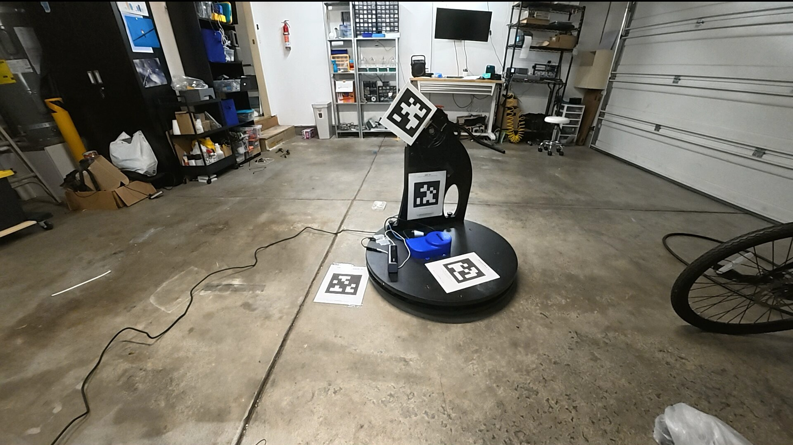

# Camera tracker (`tools/external_camera_validation/`)

An independent way to measure the mount's true yaw and pitch: a webcam watches printed AprilTags and solves the pose from the camera image. No encoders involved — this is the ground truth used to validate closed-loop accuracy.



*Live overlay: yaw/pitch readout, per-tag reprojection error, and calibration state. Runs ~90 fps at 1080p on an M-series Mac.*

## The tag rig

AprilTag 36h11, 150 mm black square. Print them and mount:

| Tag | Place it |
| --- | --- |
| `0` | Base platform (rotates with yaw) |
| `3` | Same rigid base as tag 0, roughly 90° away — extends visibility |
| `2` | Floor / room, fixed |
| `1` | Telescope (rotates with pitch) |



Tags 0 and 3 are treated as one rigid object: press **B** once with both visible and the tracker learns their fixed transform, then fuses the two estimates whenever both are in view.

## Run

```sh
cd tools/external_camera_validation
.venv/bin/python telescope_tracker_dual_base_with_log.py
```

Keys: **B** learn base pair · **C** clear pair · **Z** zero here · **X** clear zero · **Q** quit.

Calibration data is saved next to the script (`camera_calibration.npz`, `mount_zero_dual_base.npz`, …) so it survives restarts.

## Output

`telescope_angles.csv` is atomically rewritten every 0.5 s with the last 10 samples (`datetime,yaw,pitch`). When the pose can't be measured it writes `nan` instead of stale values, so consumers can tell "lost" from "unchanged". This file is what `motor-sense-telescope`'s external calibration sweeps read — see [tools.md](tools.md).
