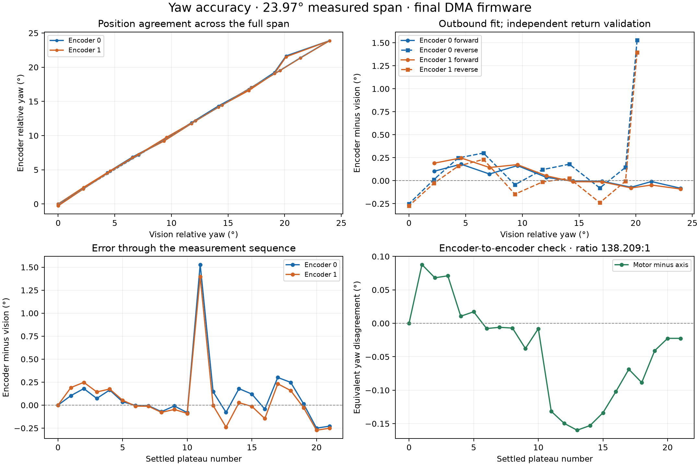

# Both yaw encoders working: firmware repair and 24° validation

**17 September 2026 — board 90:70:69:1C:48:54, CAN ID 78**

Encoder 1 now counts reliably in the tested movements on the actual board. The repaired firmware remains installed. It acquired **10,761,728 motor A/B pairs** during the out-and-back experiment, with **zero DMA overflows, read errors, channel-order errors, or invalid quadrature transitions**. Encoder 0 also had **zero invalid transitions and zero ADC read failures during the experiment**.

## Accuracy against vision

The outbound sweep covered **23.954°**, from a settled camera yaw of **23.168° to 47.122°**, followed by a return to **23.175°**. There were **10 outbound and 10 return plateaus**, plus initial and final stationary readings. Motion was principally 60% duty in two-second, board-timed increments, with five seconds for settling after each increment. Two outbound stages were interrupted by an overly strict camera check requiring valid pitch as well as yaw; they resumed from the same positions without resetting either encoder. The collector now requires only fresh, valid yaw.

For each plateau, the last two seconds supplied the median encoder count and the mean of 4–5 unique camera yaw readings. The camera logs at roughly 0.53-second intervals. Counts were stationary in every return measurement window. Each degrees-per-tick scale was fitted **only to outbound data**, with a common initial zero and no fitted offset. Return data were held out for validation.

| Measurement | Encoder 0, GPIO11/12 | Encoder 1, GPIO9/10 |
|---|---:|---:|
| Calibration | **32.8834 ticks/°** | **4,544.8967 ticks/°** |
| Degrees per tick | **0.03041048°** | **0.000220027°** |
| Outbound fit RMS error | 0.094° | 0.130° |
| **Return RMS error, all 10 points** | **0.513°** | **0.467°** |
| Return maximum absolute error, all points | 1.529° | 1.396° |
| Return RMS error, 8 stable-reference points¹ | **0.169°** | **0.161°** |
| Return maximum absolute error, stable-reference points¹ | 0.301° | 0.273° |
| Return-to-start error versus vision | **−0.250°** | **−0.273°** |

¹ This is a **post-analysis, quality-screened comparison**, not a replacement for the all-points result. The screen requires camera yaw standard deviation ≤0.1° in the measurement window and encoder count ranges ≤1 tick. It excludes `reverse_01` and `reverse_08`, whose camera standard deviations were **1.975°** and **0.320°**. Both encoders were stationary at those points. Typical camera plateau standard deviation was **0.015°**.

At `reverse_01`, camera yaw jumped from **44.864° to 40.096° in 0.518 seconds**, then began returning, while both encoder positions remained unchanged. That is strong evidence of a reference problem, not proof of a 4.8° encoder error. The CSV does not include tracking-quality flags or an independent angle reference, so this report retains the affected measurements in its primary result rather than assuming them away.

**Interpretation:** the two encoders show similar agreement with a stable camera reference—roughly 0.17° RMS in this experiment. Encoder 1 has much finer count resolution, but this experiment does **not** establish correspondingly finer absolute pointing accuracy. Camera errors, direction-dependent mechanics, and encoder phase/threshold effects remain part of the measured discrepancies. The calibration covers this yaw region and the tested firmware, not a full revolution or a temperature/speed/load study.



## Encoder-to-encoder comparison

Fitting outbound encoder 1 counts against encoder 0 counts gives **138.209 motor ticks per axis tick**. This is an empirical count conversion, not a verified mechanical gear ratio or confirmed connector mapping.

On the independent return sweep, their disagreement, expressed in yaw degrees, was:

- **0.115° RMS**;
- **0.160° maximum**;
- **−0.105° mean** for motor-derived position minus axis-derived position.

Both tracked the full motion and reversal. The direction-dependent difference means they are not interchangeable to arbitrary precision; gearbox backlash/compliance and decoder phase effects are possible contributors, not established diagnoses.

On returning, encoder 0 changed by **−8 ticks**, encoder 1 by **−1,208 ticks**, and vision by **+0.00694°** relative to the initial reference. Those produce the −0.250° and −0.273° return errors above. After another ten stationary seconds, neither encoder moved; the camera changed by another −0.022°.

## What was wrong, and what changed

The earlier suggestion that encoder 1 was saturating more was misleading: **both pairs clipped heavily**, and in the earlier 60% buffered capture encoder 0 actually had more samples with at least one clipped channel (about 72% versus 63%). Identical supplies/connectors do not make the two signal frequencies the same, and clipping alone did not explain the difference in behavior.

The useful findings were:

1. **The motor signal is much faster.** Earlier oneshot acquisition achieved only roughly 3,000–3,600 A/B samples per second with 10–15 ms gaps. Encoder 1's signal was around 1.3 kHz at 60% duty and around 3 kHz at full duty. The old method could not reliably follow its transitions.
2. **Clipped highs still carry useful state information.** The old adaptive decoder rejected a complete sample whenever either channel reached a rail. The new Schmitt decoder treats a saturated high as high, rather than discarding it.
3. **The signal's low level rises with speed.** Motor ADC minima in captured waveforms were roughly 1,600–1,800 at 60%, 2,200–2,400 at 80%, and 2,500–2,700 at full duty. A center of 2,800 produced nearly coincident or missing crossings at higher speed. A fixed center of **3,600 with ±100 hysteresis** worked in the final forward/reverse full-duty tests and the long 60% sweep. The observations demonstrate speed-dependent signal shape; they do not identify its analog electrical/optical cause.
4. **ADC consumers had been competing.** ADC1 now belongs exclusively to continuous DMA. Diagnostics read a cached snapshot instead of interrupting acquisition. ADC2 oneshot readers are serialized, and failures are propagated rather than reported as valid zeroes.

The final firmware uses:

- **Encoder 1:** alternating ADC1 channels 8/9 through DMA, nominally **40,000 A/B pairs/s**; measured end-to-end rate was about **40,324 pairs/s**. The initially requested 100,000 pairs/s exceeded this SDK's supported ADC conversion rate and was reduced before motor testing. Hardware acquisition continues while the CPU waits for the next frame; there are no deliberate 10 ms sampling gaps.
- **Encoder 0:** **1,000 A/B pairs/s** on ADC2 with center **2,800 ±100**. It also retains clipped highs and avoids adaptive-threshold drift. Slower sampling leaves idle CPU time naturally instead of forcing long blind intervals.
- **Both:** adjacent-state x4 quadrature decoding, invalid-transition counters, atomic positions, and rate-limited serial output. Updating the count is independent of serial/BLE transmission speed. Forward motor motion increases both reported counts with the installed default inversion settings.

This required firmware changes only; no wiring, power supply, sensor, or connector was changed. A clipped ADC result does not by itself identify the input voltage or establish electrical overvoltage.

## Validation and limitations

- The final 3,600-threshold build passed short **100% forward and reverse** tests with **zero invalid transitions and no DMA data loss**. Earlier 2,800/3,400-threshold trials are retained in separate diagnostic logs; their failures are not mixed into the final 24° accuracy dataset.
- During the 24° experiment, the motor decoder accepted **221,544 directed transitions** and the axis decoder accepted **1,632**, with no invalid transitions. ADC2 had 10 startup read failures before the experiment; there were **no additional failures during it**.
- The host decoder test checks both directions, clipped inputs, stationary hysteresis/noise, and rejection/resynchronization of diagonal jumps. The ESP-IDF firmware build and web client production build passed; `git diff --check` passed.
- This is a settled-position comparison. The camera log is too slow to claim synchronized, high-speed tracking accuracy from these data.
- Actual field performance under other workloads is not guaranteed solely by these tests. `ENCODER STATS` exposes DMA overflows, acquisition errors, malformed channel order, and invalid transitions so future data loss can be detected.
- After the experiment finished, the camera log stopped advancing regularly after **21:05:34.801**, with one later isolated record at **21:15:41.089**. Optional extra speed checks were cancelled before any motor command. The completed accuracy dataset is unaffected. A later requested restart failed because OpenCV reported **“not authorized to capture video (status 0)”** under macOS; no replacement tracker process remained running. The tracker source and calibration files were not modified. The requested second motion test was skipped because the completed 24° dataset was sufficient.

## Current firmware and use

**The repaired DMA firmware is installed; the original image was not restored this time.** The motor was left stopped. The original flash backup from the earlier investigation remains available locally as `yaw-original-flash.bin`.

The tested application image SHA-256 is:

```text
c6c574711aa5a1f2de794c4ef2716611ca15c25ca3922472670d538f86a36310
```

Reconnect the yaw board in the web client. Expand **“Yaw degree readouts · encoders 0 and 1”**, stop the motor, and click **“Set both yaw zeros here.”** The client now queries the actual inversion settings and displays both relative angles with the new scales. This panel is opt-in and applies to the yaw board, not pitch. The client builds successfully; its final physical BLE interaction was not browser-tested in this session.

For other software, with the installed default inversion settings:

```text
yaw_from_encoder0 = reference_yaw + (position0 - reference_position0) × 0.03041048252
yaw_from_encoder1 = reference_yaw + (position1 - reference_position1) × 0.0002200270028
```

Take both reference positions while stationary. Re-zero after reboot or reconnection; account for sign if inversion settings are changed. These new-firmware factors supersede the earlier original-image calibration.

## Data and reproducibility

- [Raw timestamped 24° experiment](dma-20deg-sweep.jsonl): serial telemetry, commands, stage names, camera timestamps/angles, and firmware hash.
- [Plateau measurements](dma-20deg-plateaus.csv): all 22 stationary summaries, including the two unstable vision intervals.
- [Complete numerical results](dma-20deg-results.json): fits, validation errors, quality screen, counter deltas, and per-point errors.
- [Machine-readable calibration](yaw-dma-calibration.json).
- [Final-threshold speed tests](dma-final-speed-tests.jsonl).
- [Collector](sweep_yaw.py), [analysis](analyze_dma_sweep.py), and [plot generator](plot_dma_sweep.py).

From the repository root:

```sh
local_tools/.venv/bin/python local_tools/calibration/analyze_dma_sweep.py
uv run --quiet --no-project --with matplotlib --with numpy python local_tools/calibration/plot_dma_sweep.py
cc -std=c11 -Wall -Wextra -Werror -I main/include local_tools/calibration/test_encoder_schmitt.c -o /tmp/test-yaw-schmitt
/tmp/test-yaw-schmitt
```

The collector refuses to overwrite the experiment file. Re-running motor measurements requires fresh camera yaw and a new output filename. Both host cleanup and the board's independent timed motor stop are used.
